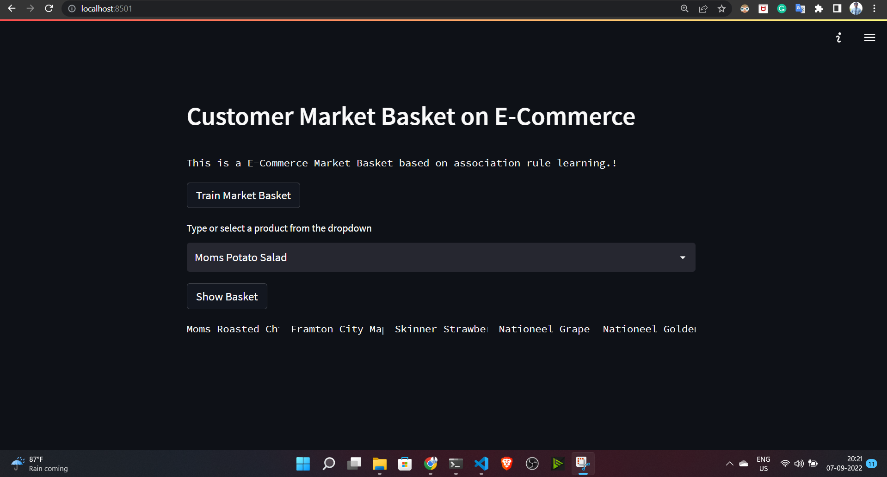

# Project: Customer-Market-Basket-on-E-Commerce


### Customer Market Basket Analysis using Apriori and Fpgrowth algorithms

In this data science project, you will learn how to perform market basket analysis with the application of Apriori and FP growth algorithms based on the concept of association rule learning.

Analysis of historical customer data can highlight if a certain combination of products purchased makes an additional purchase more likely. This is called market basket analysis (also called as MBA). It is a widely used technique to identify the best possible mix of frequently bought products or services. This is also called product association analysis. The set of items a customer buys is referred to as an itemset, and market basket analysis seeks to find relationships between purchases. Market Basket Analysis creates If-Then scenario rules, for example, if item A is purchased then item B is likely to be purchased. The rules are probabilistic in nature or, in other words, they are derived from the frequencies of co-occurrence in the observations. Market Basket analysis is particularly useful for physical retail stores as it can help in planning floor space and product placement amongst many other benefits.


### Note:

If you want to understand this entire project overflow, please refer the jupyter notebook file inside
notebook folder.

# Demo:




# Built With
1. streamlit
2. Machine learning
3. Apriori and Fpgrowth algorithms
4. Association rule learning

# How to run?
### STEPS:

Clone the repository

```bash
https://github.com/entbappy/Customer-Market-Basket-on-E-Commerce.git
```
### STEP 01- Create a conda environment after opening the repository

```bash
conda create -n basket python=3.7.10 -y
```

```bash
conda activate basket
```


### STEP 02- install the requirements
```bash
pip install -r requirements.txt
```


Now run,
```bash
streamlit run app.py
```

```bash
Note: Before clicking on show Busket first of all click on Train Market Basket for generating models
```


